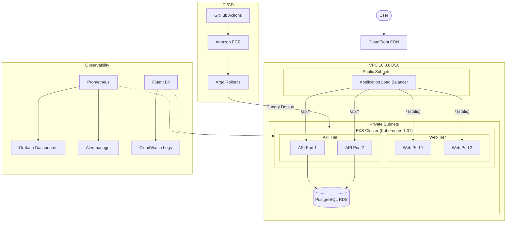
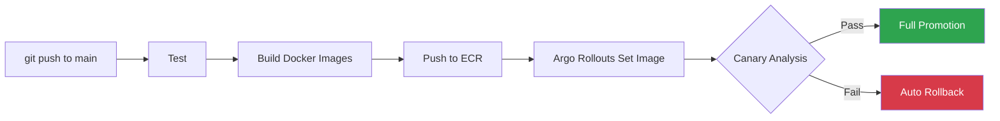
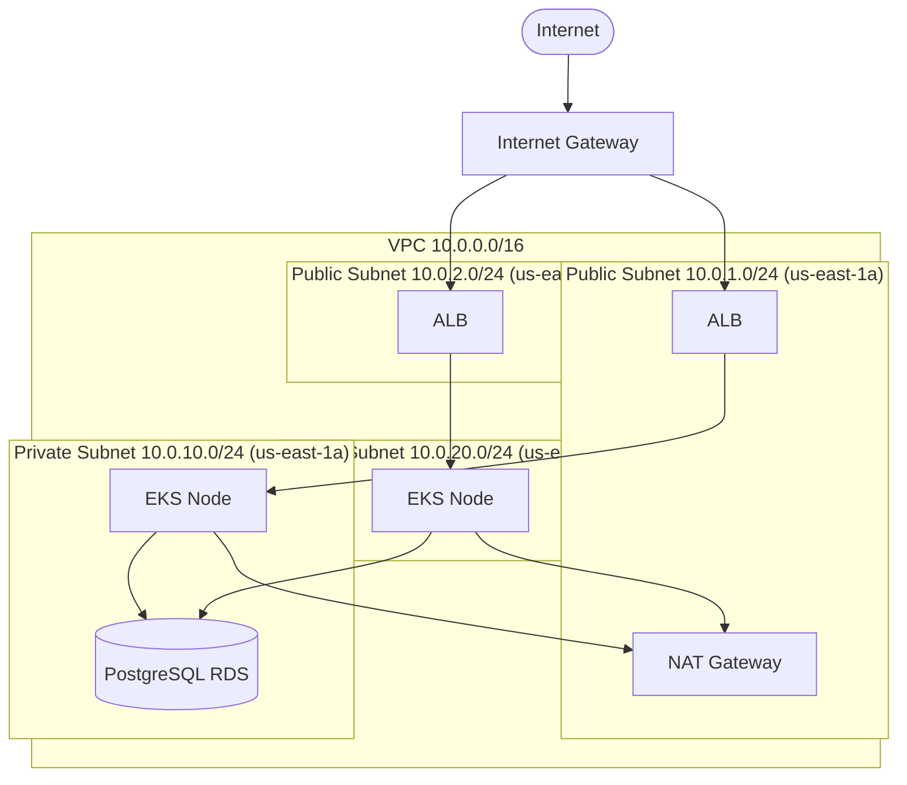

# Continuous Delivery — 3-Tier Application

Enterprise-grade continuous delivery pipeline for a Node.js 3-tier application deployed on AWS EKS with zero-downtime deployments.

## Architecture



## Tech Stack

| Component | Technology |
|-----------|-----------|
| **Cloud** | AWS (us-east-1) |
| **IaC** | Terraform (S3 + DynamoDB state) |
| **Container Orchestration** | EKS (Kubernetes) |
| **Zero-Downtime Deployments** | Argo Rollouts (Canary strategy) |
| **CI/CD** | GitHub Actions |
| **Container Registry** | ECR |
| **Database** | RDS PostgreSQL 15 |
| **CDN** | CloudFront |
| **Centralized Logging** | Fluent Bit → CloudWatch |
| **Metrics & Alerting** | Prometheus + Grafana + Alertmanager |
| **Secrets Management** | AWS Secrets Manager + External Secrets Operator |
| **Backups** | RDS automated + manual snapshots via CronJob |

## Repository Structure

```
├── app/
│   ├── web/          # Web tier (Express + Jade, port 3000)
│   └── api/          # API tier (Express + pg, port 3000)
├── docker/
│   ├── web/Dockerfile
│   └── api/Dockerfile
├── terraform/
│   ├── providers.tf  # AWS provider config
│   ├── backend.tf    # S3 state backend
│   ├── variables.tf  # Input variables
│   ├── vpc.tf        # VPC, subnets, NAT, IGW
│   ├── eks.tf        # EKS cluster, node groups, OIDC
│   ├── rds.tf        # PostgreSQL RDS
│   ├── ecr.tf        # Container registries
│   ├── alb.tf        # Application Load Balancer
│   ├── cloudfront.tf # CDN distribution
│   ├── secrets.tf    # Secrets Manager + IRSA for ESO
│   ├── s3.tf         # Backup bucket
│   └── outputs.tf    # Output values
├── k8s/
│   ├── base/
│   │   ├── namespace.yaml
│   │   ├── db-secret.yaml.example  # Template — copy to db-secret.yaml
│   │   ├── external-secret.yaml    # AWS Secrets Manager → K8s Secret
│   │   ├── analysis-template.yaml  # Prometheus canary health check
│   │   ├── api-rollout.yaml        # Argo Rollout (canary)
│   │   ├── api-service.yaml
│   │   ├── web-rollout.yaml        # Argo Rollout (canary)
│   │   ├── web-service.yaml
│   │   ├── hpa.yaml                 # Horizontal Pod Autoscaler
│   │   ├── ingress.yaml            # ALB Ingress
│   │   └── backup-cronjob.yaml     # Daily DB backup CronJob
│   ├── monitoring/
│   │   ├── prometheus-grafana.yaml     # Prometheus + Grafana stack
│   │   ├── fluent-bit.yaml             # Centralized logging → CloudWatch
│   │   ├── grafana-trust-policy.json   # IRSA trust policy
│   │   └── fluent-bit-trust-policy.json # IRSA trust policy
│   ├── aws-lb-controller-policy.json   # IAM policy for ALB controller
│   └── iam_policy.json                 # AWS LB Controller IAM policy
├── .github/workflows/
│   └── ci-cd.yaml    # GitHub Actions pipeline
├── scripts/
│   ├── setup/
│   │   └── bootstrap-state.sh  # Create S3/DynamoDB for TF state
│   ├── backup/
│   │   └── backup-db.sh        # Manual RDS backup script
│   └── runtime/
│       ├── start.sh    # Start infrastructure
│       ├── stop.sh     # Stop to save costs
│       ├── scale.sh    # Scale app replicas
│       └── status.sh   # Check all component status
└── README.md
```

## Zero-Downtime Deployment Strategy

Uses **Argo Rollouts** with a canary strategy backed by Prometheus-based analysis:

1. **20% traffic** → new version (20s pause)
2. **Canary analysis** — Prometheus evaluates 5 health signals (see below)
3. **50% traffic** → new version (20s pause)
4. **Canary analysis** — second round of health checks
5. **80% traffic** → new version (15s pause)
6. **100% traffic** → full promotion

At each analysis step, Prometheus evaluates five health signals:
- **Restart rate** — fail if > 1 container restart in 2 minutes (crash loop detection)
- **Pod readiness** — fail if canary pods are not ready to serve traffic
- **OOM kill detection** — fail if any container is terminated due to memory exhaustion
- **CPU saturation** — fail if canary pods use > 90% of CPU limit (resource exhaustion)
- **Memory saturation** — fail if canary pods use > 90% of memory limit (approaching OOM)

If any metric breaches its threshold, the rollout automatically rolls back to the stable version.

## CI/CD Pipeline

GitHub Actions workflow (`.github/workflows/ci-cd.yaml`):



| Stage | Trigger | What Happens |
|-------|---------|-------------|
| **Test** | Push & PR to `main` | Install dependencies, run unit tests for both tiers |
| **Build** | Push to `main` only | Build Docker images, tag with commit SHA + `latest` |
| **Push** | Push to `main` only | Push images to Amazon ECR |
| **Deploy** | Push to `main` only | `kubectl-argo-rollouts set image` triggers canary rollout with Prometheus analysis |
| **Verify** | After deploy | Confirm rollout status and pod health |

## Infrastructure Setup

### Prerequisites
- AWS CLI configured
- Terraform >= 1.5.0
- kubectl
- Docker
- Helm

### Deploy Infrastructure

```bash
# 1. Bootstrap Terraform state
cd scripts/setup && bash bootstrap-state.sh

# 2. Deploy infrastructure
cd terraform
terraform init
terraform plan
terraform apply

# 3. Configure kubectl
aws eks update-kubeconfig --name toptal-3tier-eks --region us-east-1

# 4. Install Argo Rollouts
kubectl create namespace argo-rollouts
kubectl apply -n argo-rollouts -f https://github.com/argoproj/argo-rollouts/releases/latest/download/install.yaml

# 5. Install AWS Load Balancer Controller (via Helm)
helm install aws-load-balancer-controller eks/aws-load-balancer-controller \
  -n kube-system --set clusterName=toptal-3tier-eks

# 6. Install External Secrets Operator (syncs AWS Secrets Manager → K8s)
helm repo add external-secrets https://charts.external-secrets.io
helm install external-secrets external-secrets/external-secrets \
  -n external-secrets --create-namespace

# 7. Deploy application
kubectl apply -f k8s/base/
kubectl apply -f k8s/monitoring/
```

## Monitoring, Alerting & Logging

- **Fluent Bit** runs as a DaemonSet, shipping all container logs to CloudWatch (`/eks/toptal-3tier`)
- **Prometheus** scrapes Kubernetes metrics (pods, nodes, endpoints) with **10Gi persistent storage** (gp2 PVC)
- **Alertmanager** routes alerts via email with severity-based grouping, 1h repeat for critical / 4h for warnings
- **8 Prometheus alert rules** in two groups:
  - *Application alerts*: PodCrashLooping, PodNotReady, HighCPUUsage, HighMemoryUsage, ContainerOOMKilled
  - *Infrastructure alerts*: HighNodeCPU, HighNodeMemory, PersistentVolumeFillingUp
- **Grafana** provides dashboards with **5Gi persistent storage** (gp2 PVC)
  - Port-forward: `kubectl port-forward svc/grafana 3000:3000 -n monitoring`
  - Credentials stored in Kubernetes Secret (`grafana-credentials`)

## Backups

- **RDS Automated Backups**: 7-day retention, daily window 03:00-04:00 UTC
- **Manual Snapshots**: K8s CronJob runs daily, creates RDS snapshots
- **Backup Script**: `scripts/backup/backup-db.sh` for on-demand backups

## Runtime Operations

```bash
# Check status of all components
bash scripts/runtime/status.sh

# Stop infrastructure (cost saving)
bash scripts/runtime/stop.sh

# Start infrastructure
bash scripts/runtime/start.sh

# Scale application (e.g., to 4 replicas)
bash scripts/runtime/scale.sh 4
```

## Network Architecture



- **Public subnets**: ALB, NAT Gateway (single, us-east-1a), Internet Gateway
- **Private subnets**: EKS worker nodes, RDS (Single-AZ, Multi-AZ ready via Terraform flag)
- No direct internet access to application or database tiers

## Security

- **Pod security**: Containers run as non-root (UID 1000), read-only root filesystem, all capabilities dropped
- **Pod anti-affinity**: Replicas spread across nodes (`preferredDuringSchedulingIgnoredDuringExecution`) for high availability
- **Docker**: Images use `USER node`, Docker HEALTHCHECK defined
- RDS in private subnets, not publicly accessible
- EKS nodes in private subnets, NAT Gateway for outbound
- Security groups restrict DB access to EKS cluster only
- Terraform state encrypted in S3 with DynamoDB locking
- ECR image scanning on push
- IRSA (IAM Roles for Service Accounts) for fine-grained AWS access
- Database credentials stored in AWS Secrets Manager, synced via External Secrets Operator (IRSA-authenticated)
- Grafana credentials stored in Kubernetes Secret (not hardcoded in manifests)
- CloudFront enforces HTTPS with redirect

## Auto-Scaling

Horizontal Pod Autoscaler (HPA) configured for both web and API tiers:

- **Scale up**: When CPU > 70% or memory > 80% average utilization
- **Scale down**: 5-minute stabilization window to prevent flapping
- **Range**: 2–6 replicas per tier
- **Behavior**: Scale up by 2 pods per minute, scale down by 1 pod per 2 minutes

## Key Design Decisions

| Decision | Rationale |
|----------|-----------|
| **Argo Rollouts over native K8s Deployments** | Native rolling updates lack traffic-weighted canary support and automated analysis-driven rollback |
| **Prometheus-based canary analysis (5 signals)** | Automated rollback based on restart rate, pod readiness, OOM kills, CPU saturation, and memory saturation — no manual gates |
| **IRSA instead of node-level IAM** | Least-privilege: each service account gets only the AWS permissions it needs |
| **Fluent Bit over Fluentd** | Lower resource footprint (~40MB vs ~200MB), purpose-built for Kubernetes log forwarding |
| **Terraform with S3 backend** | Remote state with locking prevents concurrent modifications, enables team collaboration |
| **Separate web/API tiers** | Independent scaling and deployment; web tier can be cached aggressively via CDN |
| **CloudFront with path-based routing** | Static assets cached at edge (TTL 3600s); API requests pass through uncached with all headers/cookies |
| **CronJob-based DB backups** | Defence-in-depth: supplements RDS automated backups with explicit named snapshots for point-in-time recovery |
| **HPA with conservative scale-down** | 5-minute stabilization prevents flapping; aggressive scale-up (2 pods/min) ensures responsiveness |
| **Pod anti-affinity for HA** | Spreads replicas across nodes so a single node failure doesn't take down an entire tier |
| **Alertmanager with email routing** | Severity-based alerting with inhibit rules — critical alerts suppress duplicate warnings for the same issue |
| **Persistent storage for monitoring** | PVCs for Prometheus (10Gi) and Grafana (5Gi) ensure metric data and dashboards survive pod restarts |

## Production Roadmap

Improvements for a full production deployment:

| Area | Enhancement |
|------|------------|
| **TLS** | Custom domain with ACM certificate on ALB (CloudFront already enforces HTTPS) |
| **Multi-env** | Separate staging/production clusters with Terraform workspaces or Terragrunt |
| **Network Policies** | Calico/Cilium NetworkPolicies to restrict pod-to-pod communication |
| **GitOps** | ArgoCD for declarative cluster state management |
| **Observability** | PagerDuty/Slack integrations for Alertmanager, distributed tracing with OpenTelemetry |
| **Database** | RDS Multi-AZ for high availability, read replicas for scaling |
| **CI/CD** | Integration tests with ephemeral test database, SAST/DAST scanning |